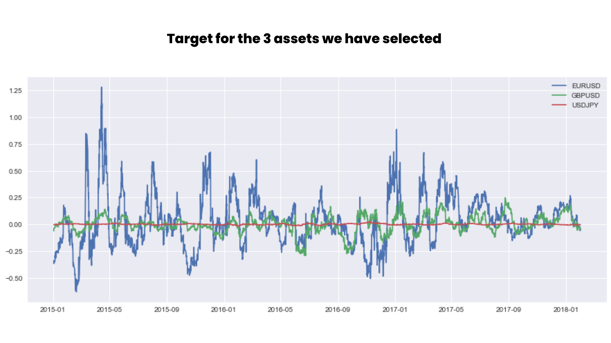
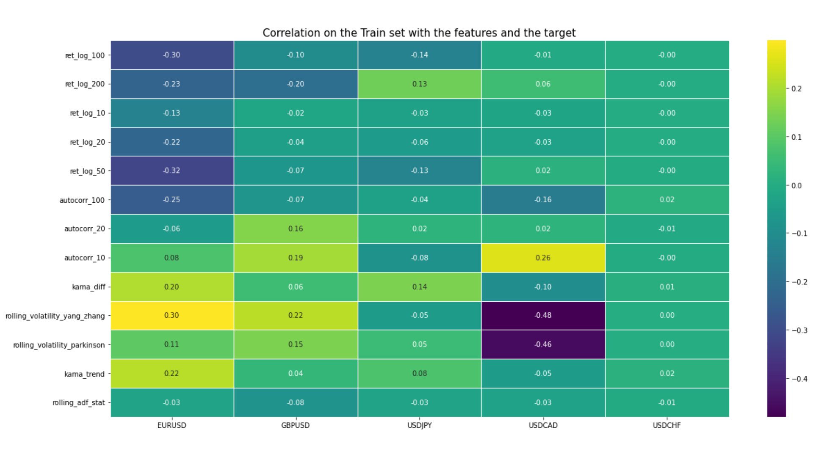
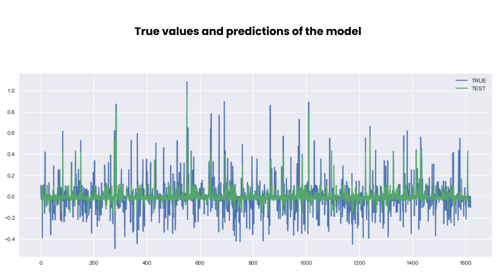

# Overview
- These notes will document the generation on an Alpha that can predict the way of the variation from now to 100 candles later with a 60% accuracy
- The goal is to bring more information about the medium-term movement.
- 
# 1. Data
- Source: Pepperstone
- Time Frame: 4H
- Period: from 2016 to 2018

We had imported the data using the 1 minute timeframe, it will help us a lot for the robustness tests we will do later on.

We will work on 5 assets: EURUSD, GBPUSD, USDJPY, USDCAD and USDCHF

# 2. Features
Here, I will make a quick recap about all the features we will create, BUT we will not use them all, it will depends on their importance.

- **ret_log_X**: Log-return calculated over X periods. It's a commonly used method to normalize returns, especially in financial time series.

- **autocorr_X**: Autocorrelation of returns over X periods. This measures the similarity between observations as a function of a given time lag.

- **kama_diff**: Difference of the Kaufman's Adaptive Moving Average (KAMA), which is a moving average designed to account for market volatility.

- **rolling_volatility_yang_zhang**: Historical volatility of returns, computed using the Yang and Zhang method which is a more accurate estimate of volatility in the presence of price jumps.

- **rolling_volatility_parkinson**: Volatility based on the highest and lowest price range, introduced by Michael Parkinson in 1980.

- **market_regime**: An indicator of the current state of the market, such as bullish trend, bearish trend thanks to the directional change indicator.

- **kama_trend**: Trend based on Kaufman's Adaptive Moving Average.

- **rolling_adf_stat**: Rolling Augmented Dickey-Fuller test statistic. This is a unit root test used to detect the presence of non-stationarity in a time series.

--> We will take only the features that look deep in the past. For example information about the price variation in the last candle will just add more noise.

# 3. Target
To create our target, we will not use the standard return BUT the log return. It means we apply a log on the price and then we compute the returns. Statisticaly, the properties of the log returns are much better.

# 4. Exploratory Data Analysis
- **Correlation Matrix**: This is a crucial tool in EDA, as it gives a quantitative measure of the linear relationships between variables. The matrix's values range from -1 to 1, representing a perfect negative correlation to a perfect positive correlation, respectively.

--> Thanks to that, we can see different things. We have one set of asset that are quite similar and where the target is correlated to many features (EURUSD, GBPUSD, USDJPY). One other asset that is also correlated but in a different way (USDCAD) and a last one that is not so correlated, so we will not try to apply the model on it.

- **MDI (Mean Decrease Impurity)**: This method calculates the total decrease in node impurity (typically measured using Gini impurity) as a result of splits over a particular variable, averaged across all trees. Features which result in large decreases are deemed important.

- **SFI (Single Feature Importance)**: This method evaluates the importance of a single feature by training the model using only that feature and measuring its performance.

--> We keep all the variables in a first step because of the Shapley value which is similar of each value and also because we have a small amount of variable.

# 5. Modelisation method

##### A. Selected Features
We keep all the features as said before, because we do not have A LOT of feature and we do not want to waste some time to remove the less important (apply a PCA can help us in this task very quickly). We will combine the features for the 3 assets  (EURUSD, GBPUSD, USDJPY) to increase the number of data.

**B. Model used**
We use a Random forest Regressor because the target is continue and we used the Random Forest Regressor to find the features importance.

##### C. Test the model
First, we have done a really quick prior test on the test data and the accuracy was really good (62% - 0.07MAE). 
Then, we apply a cross validation to check if the MAE is similar or not other time.

# 6. Results
We have a 62% accuracy on the model with 0.07 MAE. And with the cross validation we have an average MAE of 0.07 also. The added value is that the model has been trained with several assets, it makes it more robust. 
And we plot the real and predicted values to be sure the model is not overfitted or underfitted. But, here, we can see that the model is quite good.

# 7. Conclusion
- Good signal that will help us to detect the medium-term movement (100 next candles on the 4-hours timeframe), it should be a very good features if you work with swing trading strategies.

### How to improve this signal?
- Check the robustness about the target variation. (try from 95 to 105 candles to see if we still have good results)
- Create a strategy and apply the CPCV template  of the Alpha Quant program (www.quantreo.com) to check the robustness.