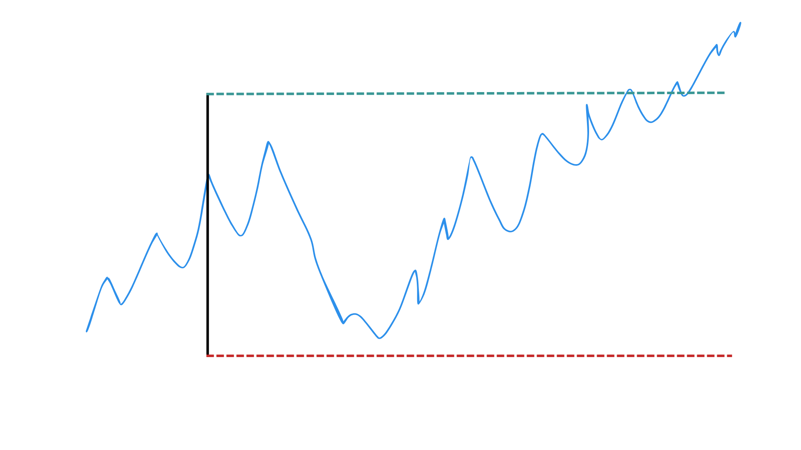
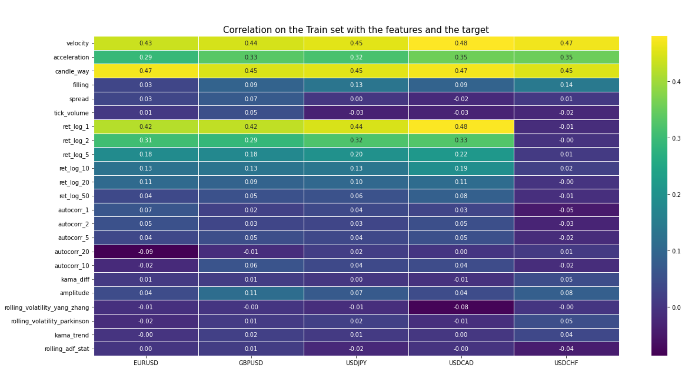
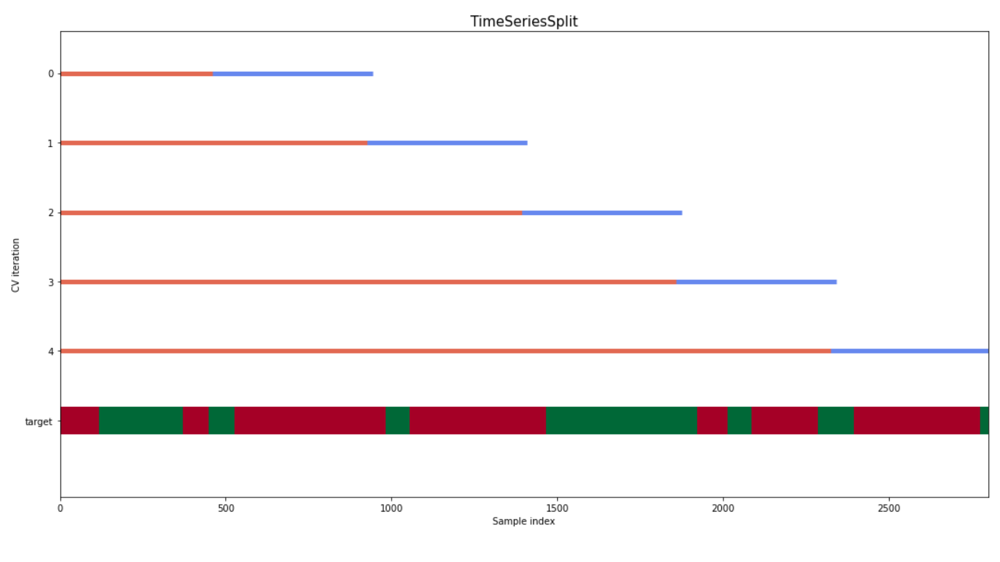

# Overview
- The goal will be to detect when we want to enter in position if we will touch the SL or the TP, and to te end to detect it using a Decision Tree Classifier.
- We will use a lot of features about volatility, trend, market regimes and more, to predict our target which is "if I begin a trade now, would I touche the SL or TP first?", in other word, the position will be a losing trade or a winning trade?

# 1. Data
- Source: Pepperstone
- Time Frame: 4H
- Period: from 2016 to 2018

We had imported the data using the 1 minute timeframe, it will help us a lot for the robustness tests we will do later on.

We will work on 5 assets: EURUSD, GBPUSD, USDJPY, USDCAD and USDCHF

# 2. Features
Here, I will make a quick recap about all the features we will create, BUT we will not use them all, it will depends on their importance.

- **velocity**: Measures the rate of price change over a given period, akin to the slope of the trendline.

- **acceleration**: Computes the second derivative of price, highlighting inflection points where price movement is accelerating or decelerating.

- **candle_way**: Perhaps a metric related to the direction and manner in which a candle forms on a candlestick chart.

- **ret_log_X**: Log-return calculated over X periods. It's a commonly used method to normalize returns, especially in financial time series.

- **rolling_volatility_yang_zhang**: Historical volatility of returns, computed using the Yang and Zhang method which is a more accurate estimate of volatility in the presence of price jumps.

- **rolling_volatility_parkinson**: Volatility based on the highest and lowest price range, introduced by Michael Parkinson in 1980.

# 3. Target
The Double Frontier approach aims to find an optimal point to enter a trade, given predefined stop-loss (SL) and take-profit (TP) boundaries.

1. **Setting Parameters**: The first step involves defining certain parameters, particularly the stop-loss (SL) and take-profit (TP) as percentages. These percentages represent the maximum loss or profit you're willing to tolerate for a trade. HERE, we take (-0.50%,0.75%)

2. **Label Generation**: For each candlestick or data point in your time series:
    - Starting from that candlestick, move forward in time and detect which boundary is hit first: the TP or the SL.
    - The label is constructed based on the outcome:
        - If TP is hit before SL, a positive label is assigned. The exact value represents how many periods (like hours) it took to reach TP.
        - If SL is hit before TP, a negative label is assigned. The value, in negative, denotes how many periods it took to reach SL.

This methodology provides both the direction (buy/sell or up/down) and the time it took to achieve the TP or SL. This time factor can be particularly insightful, as it can guide strategies on expected holding periods for trades.

**Example**:

- Given TP = 2% and SL = 1% for a starting candlestick with close price at $100.
- The TP would be at $102, and the SL would be at $99.
- If the price touches $102 before $99, the label is positive. If after 5 periods, the value would be +5. If it touches $99 first, and it took 3 periods, the label would be -3.

Here, we choose a sl at -0.50% and a tp at 0.75%

# 5. Exploratory Data Analysis
- **Correlation Matrix**: This is a crucial tool in EDA, as it gives a quantitative measure of the linear relationships between variables. The matrix's values range from -1 to 1, representing a perfect negative correlation to a perfect positive correlation, respectively.

--> We have tested a lot of features to see if they are correlated to the target. We keep the most correlated. (Confer section 2)

- **MDI (Mean Decrease Impurity)**: This method calculates the total decrease in node impurity (typically measured using Gini impurity) as a result of splits over a particular variable, averaged across all trees. Features which result in large decreases are deemed important.

- **SFI (Single Feature Importance)**: This method evaluates the importance of a single feature by training the model using only that feature and measuring its performance.

--> All the features that we took, bring information in the model, so it is a good point.

# 6. Modélisation method

##### A. Selected Features
We keep all the features that are well correlated to the target. We will combine the features for the 3 assets  (EURUSD, GBPUSD, USDJPY) to increase the number of data.

**B. Model used**
We use a Random forest Classifier because the target is continue and we used the Random Forest Regressor to find the features importance.

##### C. Test the model
We will apply a cross validation to check the robustness of the signal.

# 7. Results
- We have a very good accuracy, more than 60%. We have a 1.5 Risk Reward ratio, so it should amazing? No! As I said in my today's notes, we need to look about the ratio of winning position over all the position taken, and there we see that we fall at 41.5% of winning position.
- It is still more than the break-even point which is at 40% for a 1.5 R but it is not an excellent results, and even maybe not so significative.
