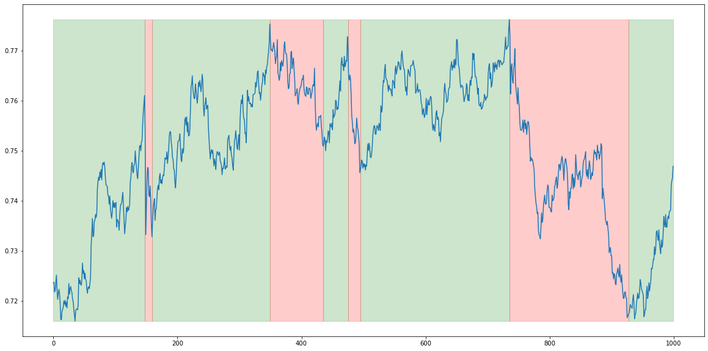
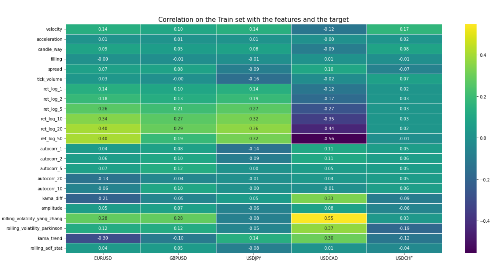
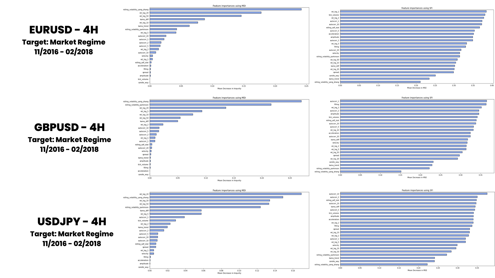

# Overview
- These notes will document the generation on an Alpha that can predict the market regime with a 60% of accuracy
- The goal is to bring more information about the trend, when we will create a strategy that is taking into account the trend of the asset.

# 1. Data
- Source: Pepperstone
- Time Frame: 4H
- Period: from 01-2018 to 09-2023

We had imported the data using the 1 minute timeframe, it will help us a lot for the robustness tests we will do later on.

We will work on 5 assets: EURUSD, GBPUSD, USDJPY, USDCAD and USDCHF

# 2. Features
Here, I will make a quick recap about all the features we will create, BUT we will not use them all, it will depends on their importance.

- **velocity**: Measures the rate of price change over a given period, akin to the slope of the trendline.

- **acceleration**: Computes the second derivative of price, highlighting inflection points where price movement is accelerating or decelerating.

- **candle_way**: Perhaps a metric related to the direction and manner in which a candle forms on a candlestick chart.

- **filling**: Likely pertains to how a candle "fills" in relation to its preceding or subsequent candles.

- **spread**: Difference between the highest and lowest price over a given period.

- **tick_volume**: The number of trades or ticks over a given period.

- **ret_log_X**: Log-return calculated over X periods. It's a commonly used method to normalize returns, especially in financial time series.

- **autocorr_X**: Autocorrelation of returns over X periods. This measures the similarity between observations as a function of a given time lag.

- **kama_diff**: Difference of the Kaufman's Adaptive Moving Average (KAMA), which is a moving average designed to account for market volatility.

- **amplitude**: Measures the range of price variation over a given period.

- **rolling_volatility_yang_zhang**: Historical volatility of returns, computed using the Yang and Zhang method which is a more accurate estimate of volatility in the presence of price jumps.

- **rolling_volatility_parkinson**: Volatility based on the highest and lowest price range, introduced by Michael Parkinson in 1980.

- **market_regime**: An indicator of the current state of the market, such as bullish trend, bearish trend thanks to the directional change indicator.

- **kama_trend**: Trend based on Kaufman's Adaptive Moving Average.

- **rolling_adf_stat**: Rolling Augmented Dickey-Fuller test statistic. This is a unit root test used to detect the presence of non-stationarity in a time series.

# 3. Target
The target is based on the Directional Change. It means when we have Ò% of variation in the positive way, we say that we are in a upward trend and if the variation is in the opposite way, it is a negative trend.

# 4. Exploratory Data Analysis
- **Correlation Matrix**: This is a crucial tool in EDA, as it gives a quantitative measure of the linear relationships between variables. The matrix's values range from -1 to 1, representing a perfect negative correlation to a perfect positive correlation, respectively.

--> Thanks to that, we can see different things. We have one set of asset that are quite similar and where the target is correlated to many features (EURUSD, GBPUSD, USDJPY). One other asset that is also correlated but in a different way (USDCAD) and a last one that is not so correlated, so we will not try to apply the model on it.

- **MDI (Mean Decrease Impurity)**: This method calculates the total decrease in node impurity (typically measured using Gini impurity) as a result of splits over a particular variable, averaged across all trees. Features which result in large decreases are deemed important.

- **SFI (Single Feature Importance)**: This method evaluates the importance of a single feature by training the model using only that feature and measuring its performance.

--> We keep all the variables in a first step beause of the shapley value and to avoid to waste to much time.

# 5. Modélisation method

##### A. Selected Features
We keep all the features as said before, because we do not have A LOT of feature and we do not want to waste some time to remove the less important (apply a PCQ can help us in this task very quickly). We will combine the features for the 3 assets  (EURUSD, GBPUSD, USDJPY) to increase the number of data.

**B. Model used**
We use a Random forest Classifier because the target is binary (0 or 1) and we used the Random Forest Classifier to find the features importance.

##### C. Test the model
First, we have done a really quick prior test on the test data and the accuracy was really good (74%). But, I have the intuition that it was really good because the train_test_split function shuffle the data.
So, to fix this problem and verify my assumption, I realised a cross validation with a TimeSeriesSplit. And finally, we had an average accuracy of 60% which is still quitte good.

# 6. Results
We have a 60% accuracy on the model with the cross validation. The added value is that the model has been trained with several assets, it makes it more robust. 

# 7. Conclusion
- Our current model yields strong results for the designated target.
- However, several issues have been identified:
	- The target might not be optimal. For instance, if a Directional Change (DC) begins tomorrow during a bullish trend, the present target doesn't cater to such scenarios.
	- The target definition requires revisiting, but we're constrained by time.
	- Potential overfitting problems associated with the model.
- **Recommendations moving forward:
	- Despite the challenges, the signal appears predictable. It's worthwhile to refine the target and monitor if the high accuracy is maintained.
	- Explore other currencies. Particularly, consider asset bagging with additional currencies, like USDCAD, to enhance the strategy's robustness.