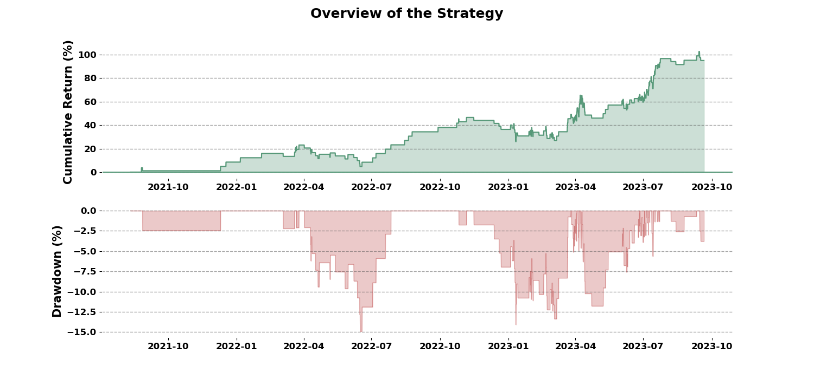
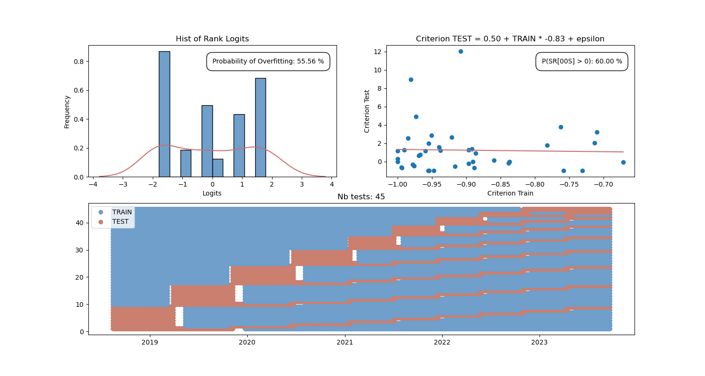

### **1. Underlying Theory**
- **Explanation**: On the long-term the market comes back to the equilibrium. Always! It means that on shorter periods, we can find opportunities.
    
- **Relation with Signals**: To model our theory, we will use the double barrier signal that help us to understand when we should enter in position or not.

- We will focus on the sell signal because for the short-term variation, it is the best (from my experience)

### **2. Strategy Objective**
- Establish a intra-day trading strategy which will allow us to take advantage of the market desequilibrium. 

### **3. Instruments & Data**
- **Instruments**: On the Ethereum
- **Data**: 2018-2023

### **4. Entry & Exit Signals**
- **Entry**: When our signal is equal to 1
- **Exit**: When we touch the take profit or the stop loss: -0.50% or 0.75% of P&L

### **5. Risk Management**
- **Position Sizing**: We will simulate that we will invest 100% of our capital, but we will mange the allocation later when we will combine different trading strategies
- **Stop-Loss**: -0.50%
- **Take-Profit**: 0.75%

### **6. Backtesting & Optimization**

**A. Variable to Optimize**
As we will use a PCA, an optimization on the period of the features will be unoptimal. That's why, I prefered optimizing the depth of my model, a Tree Classifier. The possibilities are (3.,4.,5.,6.,7.,8.). Moreover, we will add a new method which is the PCA method. As the Decision Tree is a less complex model than the Random Forest, we will reduce the number of variable.

##### B. Optimization Method
We use a Walk-Forward optimization on the first 5000 data of the dataset to find if we have an interesting relationship. Walk-Forward is time-aware validation and is especially suitable for time series data like in trading. It ensures that the model is tested on data points that are chronologically after the training data, reflecting a realistic scenario in trading where the future is unknown.

### **7. Results**

------------------------------------------------------------------------------------------------------------------
 AVERAGE TRADE LIFETIME: 0D  6H  49M 	 Nb BUY: 0 	 Nb SELL: 248 

 Return (period): 98.17% 				 Maximum drawdown: 13.11%
 HIT ratio: 47.58% 		         		     R ratio: 1.45
 Best month return: 35.75% 			 Worse month return: -9.05%
 Average ret/month: 4.04% 				 Profitable months: 53.85%
------------------------------------------------------------------------------------------------

### **8. Limitations**
- We have only one asset, the ETH-USD which will increase the odds to have an overfitting problem.
- Moreover the results of our robustness test confirm what I'm saying. 

### **9. Conclusion**
- The strategy has very good results
- But, it is not robust enough to be put in live trading without more test
- Let's try to put it in paper trading for a period between 3 and 6 months, but at the first sign of overfitting, we need to remove it.